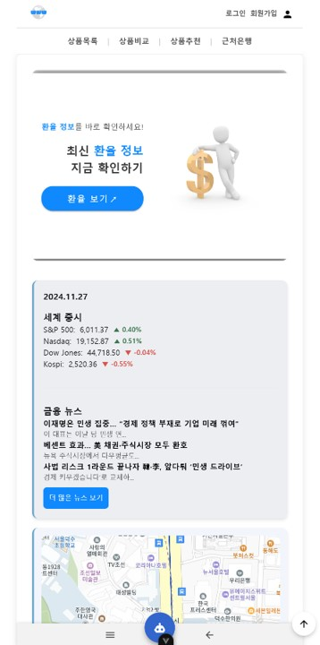
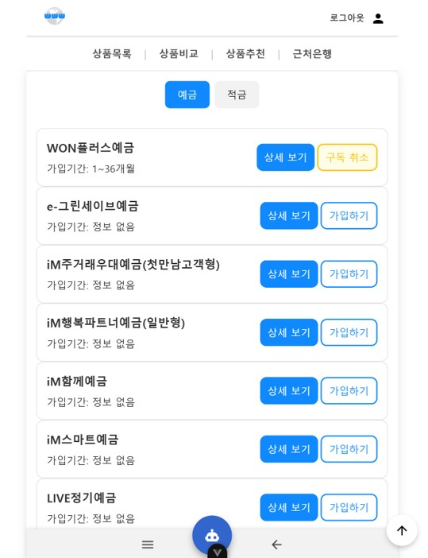
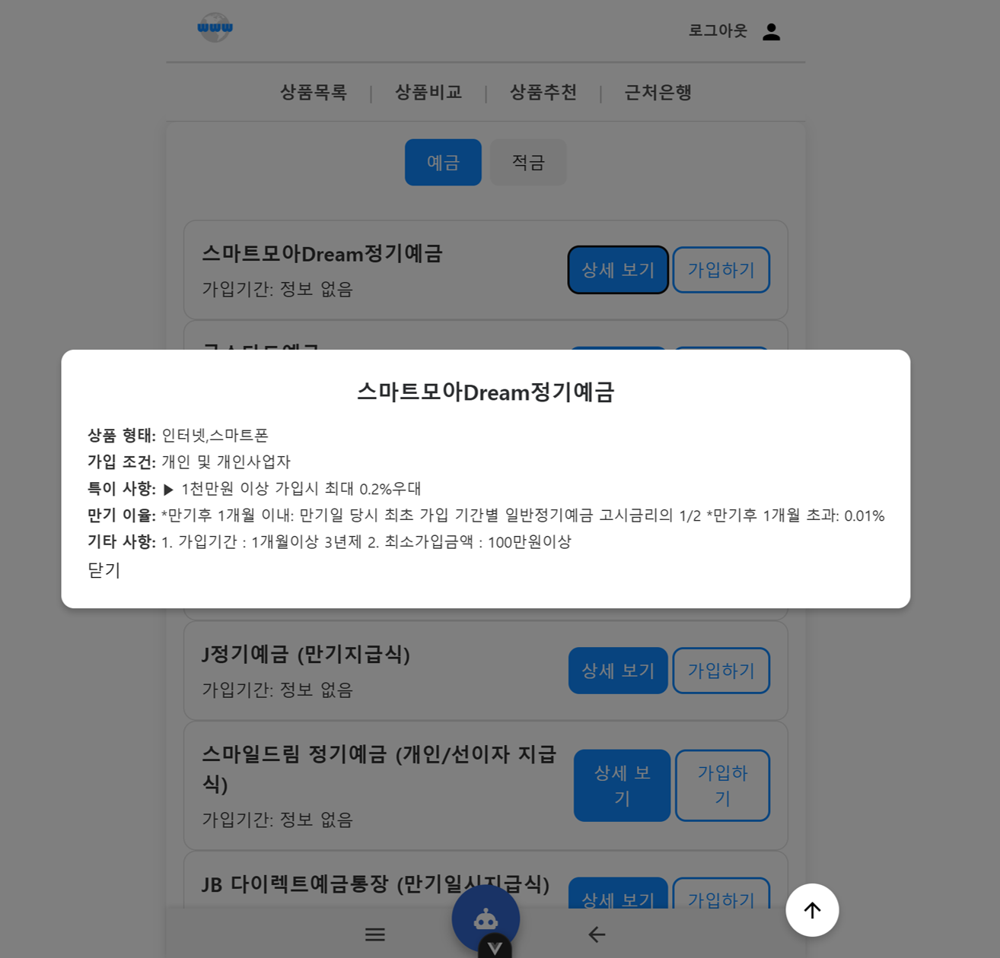
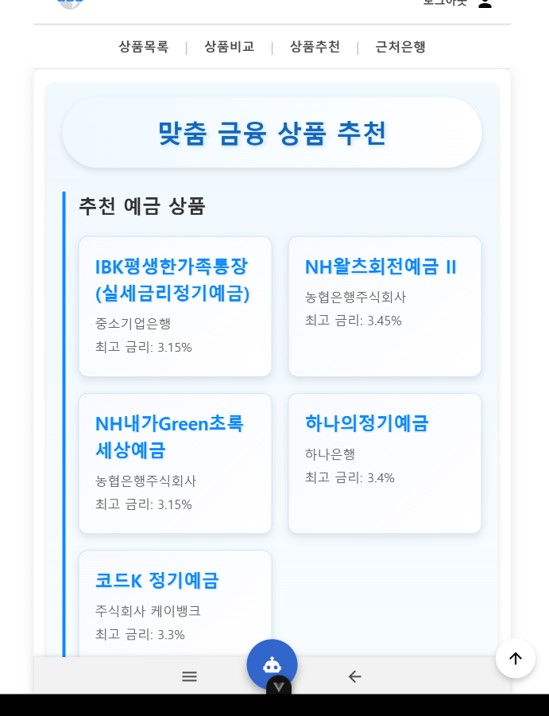
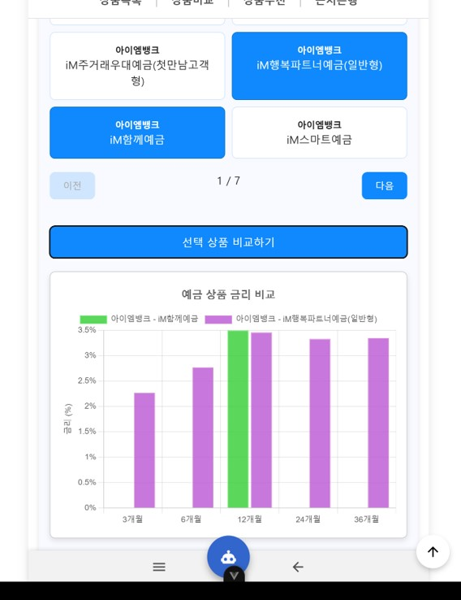
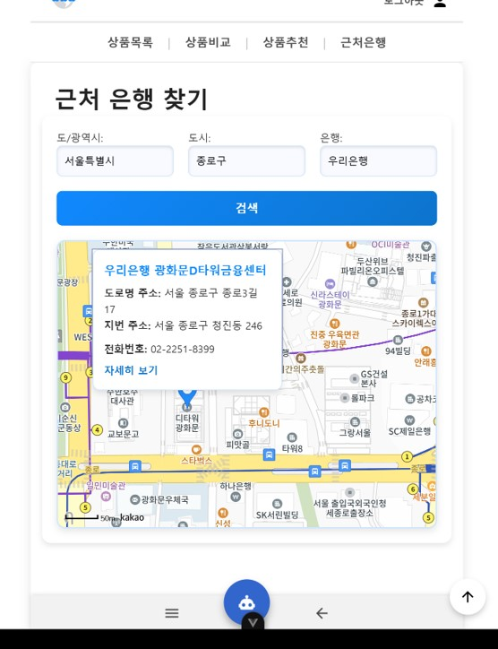
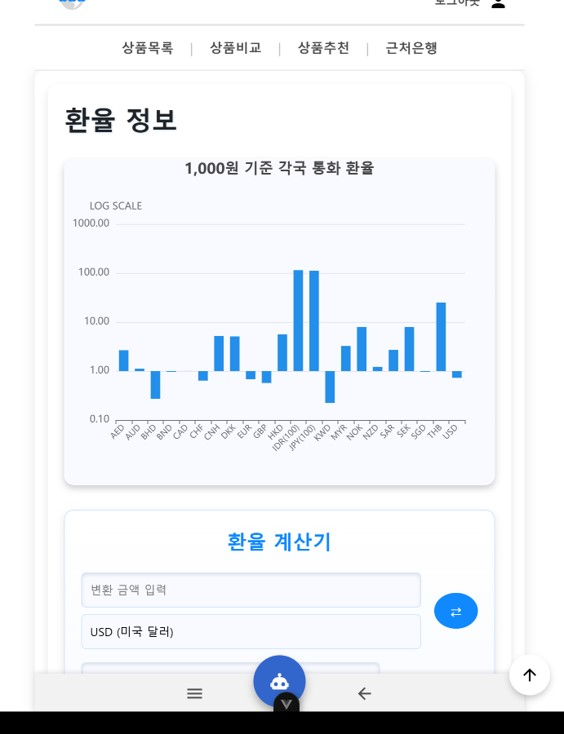
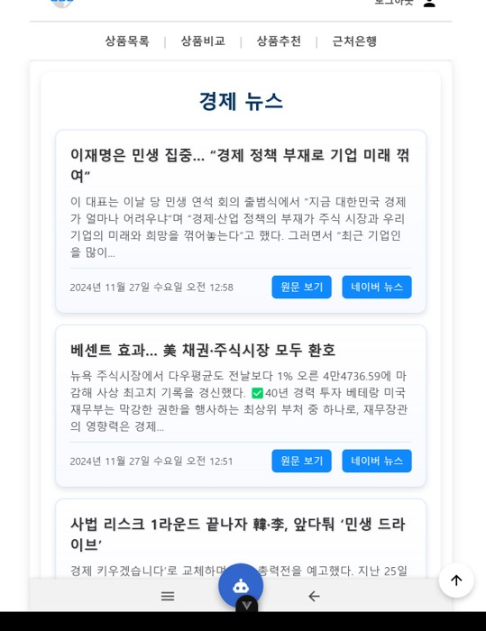
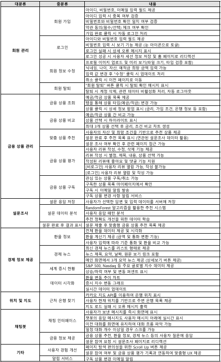
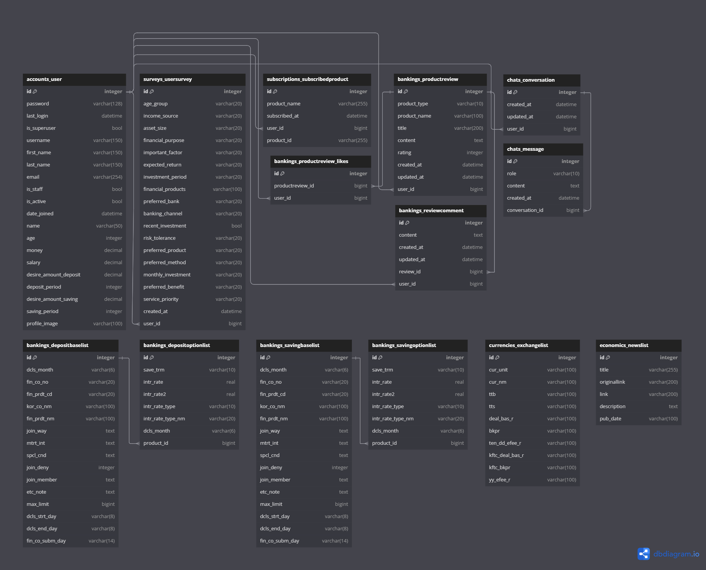

# World Wide Wealth (WWW)

<p align="center">
  
</p>

SSAFY 관통프로젝트 : 사용자 맞춤형 금융 상품 추천 웹 개발<br>
개발 기간 : 2024/11/18 ~ 2024/11/26 (약 2주)

## 프로젝트 소개

World Wide Wealth는 사용자 맞춤형 금융 상품 추천 시스템으로, 예금 및 적금 상품의 실시간 비교, 챗봇 기반의 설문 조사, 맞춤형 금융 상품 추천, 환율 계산기, 주변 은행 위치 검색 등의 기능을 제공합니다.

외부 금융기관의 API를 활용하여 실시간 정보를 제공하며, 사용자는 로그인 후 개인 자산 정보, 선호도를 기반으로 적절한 상품을 추천받을 수 있습니다. 또한 금융 상품에 대한 리뷰 및 커뮤니티 기능을 통해 정보 공유가 가능합니다.

### 배포 주소

개발 버전: `배포 X`<br>
Frontend 서버: `배포 X`<br>
Backend 서버: `http://127.0.0.1:8000`<br>

### 팀 소개

| 이름   | 역할         | GitHub 링크                                | 비고                        |
| ------ | ------------ | ------------------------------------------ | --------------------------- |
| 박진수 | 팀장, 백엔드 |                                            | Vue.js 기반 프론트엔드 개발 |
| 김찬호 | 팀원, 프론트 | [@nonamed19](https://github.com/nonamed19) | FastAPI 기반 백엔드 개발     |

## 시작 가이드

### Requirements

For building and running the application you need:

```
- Python 3.10+
- FastAPI + SQLAlchemy
- Node.js LTS (16+)
- Vue 3
```

### Installation

```bash
$ git clone https://github.com/nonamed19/WWW_Financial_Webpage.git
$ cd world-wide-wealth
```

#### Backend

```bash
$ cd backend
$ python -m venv .venv
$ .venv\Scripts\activate
$ pip install -r requirements.txt
$ copy .env.example .env
$ python run.py
```

#### Frontend

```bash
$ cd ../frontend
$ npm install
$ npm run dev
```

## 기술 스택

### Environment

- OS: Windows
- DB: SQLite
- API: OpenAI, 금융감독원, 한국수출입은행, 네이버 뉴스, 카카오맵

### Config

- dotenv: 환경변수 관리
- Resend API: 이메일 발송

### Development

- Backend: FastAPI + SQLAlchemy
- Frontend: Vue 3 + Composition API + Pinia
- ML(AI): RandomForestClassifier

### Communication

- GitHub
- GitLab
- Notion

### 외부 API

- 금융감독원 API
- 한국수출입은행 API
- OPENAI ChatGPT

## 화면 구성

|                                        메인 페이지                                        |                                 금융상품 리스트                                 |                                  금융상품 상세                                   |                                      금융상품 추천                                      |
| :---------------------------------------------------------------------------------------: | :-----------------------------------------------------------------------------: | :------------------------------------------------------------------------------: | :-------------------------------------------------------------------------------------: |
|                      |    |  |  |
|                                       금융상품 비교                                       |                                 근처 은행 찾기                                  |                                    환율 정보                                     |                                        경제 뉴스                                        |
|  |  |           |            |

## 주요 기능

- 맞춤형 금융 상품 추천 (설문 기반 + ML 기반)
- 예금/적금 상품 비교 및 상세 조회
- 챗봇 UI 기반 설문 인터페이스
- 사용자 기반 리뷰 작성, 댓글, 좋아요
- 환율 계산기 기능 (한국수출입은행 API)
- 카카오맵을 활용한 주변 은행 검색
- 금융 뉴스 실시간 제공 (네이버 API)
- 구독 기능 및 이메일 알림

## 아키텍쳐

### API 명세서

<p>
  
</p>

### ERD

<p align="center">
  
</p>

## 기타 추가 사항들

보안 관련: API Key는 `.env` 파일로 관리하며 `.gitignore`에 포함되어 있습니다.

향후 계획:

- 예/적금 외의 투자 상품 확장
- 딥러닝 기반 추천 고도화
- 글로벌 서비스 확장 준비

### 느낀 점, 후기

**박진수** : 머신러닝 분류 작업에서 기준치에 대한 명확한 이해가 부족했다 사료돼, 예측의 정확도가 아쉬웠다. 객체를 학습하는 과정을 발전시키고싶은 욕심이 생겼다.
백엔드의 필드들을 미리 정리하고 필요한 부분을 표시해가며 개발해야하는 필요성을 뼈저리게 느꼈다. 또한 디자인과 배치를 좀 더 미리 설정하고 구현할 수 있도록 피그마나 프론트엔드 측면에서 다른 배움의 과정의 진행할 예정이다.

**김찬호** : Python 기반 백엔드를 FastAPI와 SQLAlchemy 구조로 전환했습니다. API 계약과 데이터 모델을 명확히 관리하고, 초기 기획과 팀 간 협업을 통해 개발 과정의 불확실성을 줄이는 일이 중요하다는 점을 배웠습니다.
